# Architecture & Dependency Diagrams

## Table of Contents
1. [Software Architecture Patterns](#software-architecture-patterns)
2. [Overall System Architecture](#overall-system-architecture)
3. [Module Dependency Graph](#module-dependency-graph)
4. [Class Hierarchy](#class-hierarchy)
5. [Request Flow Diagram](#request-flow-diagram)
6. [Data Model Relationships](#data-model-relationships)
7. [Service Layer Architecture](#service-layer-architecture)

---

## Software Architecture Patterns

This project implements **multiple complementary software architecture patterns** to create a maintainable, testable, and scalable microservice.

### Pattern Overview

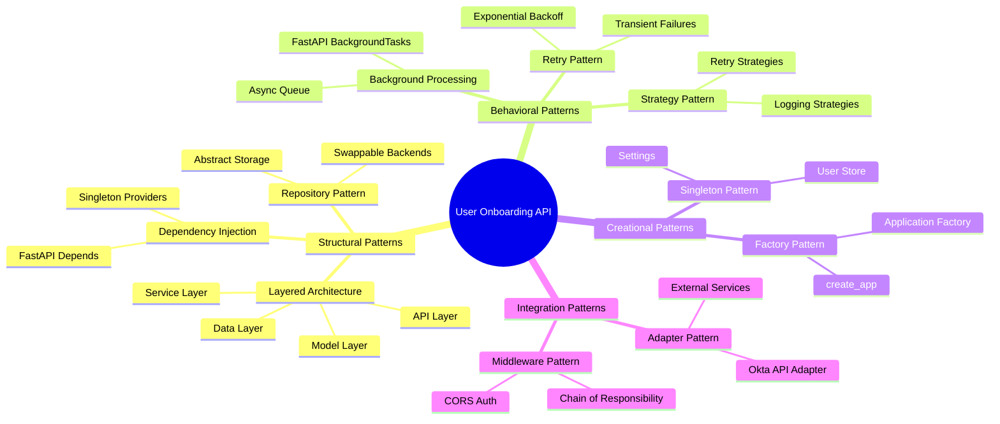

### 1. **Layered Architecture (N-Tier)** 🏗️

The project follows a clear layered structure with separation of concerns:

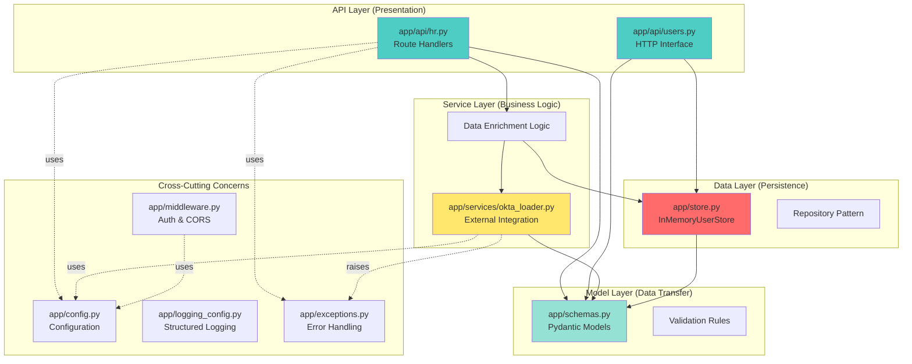

**Benefits:**
- ✅ Each layer has single responsibility
- ✅ Easy to test layers independently
- ✅ Can swap implementations (e.g., Redis for InMemory)
- ✅ Clear dependencies (downward only)

---

### 2. **Dependency Injection Pattern** 💉

FastAPI's built-in DI system decouples components:

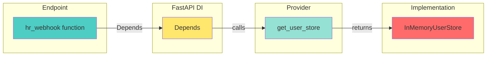

**Example:**
```python
# app/dependencies.py
def get_user_store() -> InMemoryUserStore:
    return init_user_store()

# app/api/hr.py
@router.post("/webhook")
async def hr_webhook(
    hr_user: HRUserIn,
    store: InMemoryUserStore = Depends(get_user_store),  # ← DI
):
    ...
```

**Benefits:**
- ✅ Loose coupling between components
- ✅ Easy to mock for testing
- ✅ Can swap implementations without changing endpoints

---

### 3. **Repository Pattern** 📦

Abstract storage interface enables flexible persistence:

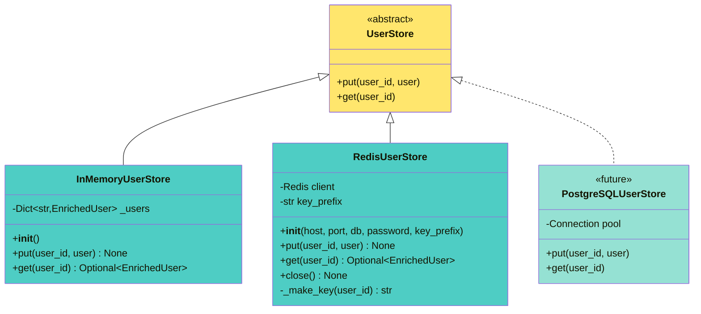

**Implemented Backends:**

**1. In-Memory Storage (Default):**
```python
class InMemoryUserStore(UserStore):
    def __init__(self) -> None:
        self._users: Dict[str, EnrichedUser] = {}
    
    def put(self, user_id: str, user: EnrichedUser) -> None:
        self._users[user_id] = user
    
    def get(self, user_id: str) -> Optional[EnrichedUser]:
        return self._users.get(user_id)
```

**2. Redis Storage (Production-Ready):**
```python
class RedisUserStore(UserStore):
    def __init__(self, host: str, port: int, db: int, 
                 password: Optional[str], key_prefix: str):
        self.client = redis.Redis(host=host, port=port, db=db, 
                                   password=password, decode_responses=True)
        self.key_prefix = key_prefix
        self.client.ping()  # Verify connection
    
    def put(self, user_id: str, user: EnrichedUser) -> None:
        key = f"{self.key_prefix}{user_id}"
        self.client.set(key, user.model_dump_json())
    
    def get(self, user_id: str) -> Optional[EnrichedUser]:
        key = f"{self.key_prefix}{user_id}"
        data = self.client.get(key)
        return EnrichedUser.model_validate_json(data) if data else None
```

**Configuration-Driven Selection:**
```python
# Set STORAGE_BACKEND=memory (default) or STORAGE_BACKEND=redis
def init_user_store() -> UserStore:
    settings = get_settings()
    if settings.storage_backend == "redis":
        return RedisUserStore(...)  # Redis configuration from settings
    else:
        return InMemoryUserStore()
```

---

### 4. **Background Processing Pattern** ⚡

Asynchronous webhook processing with immediate response:

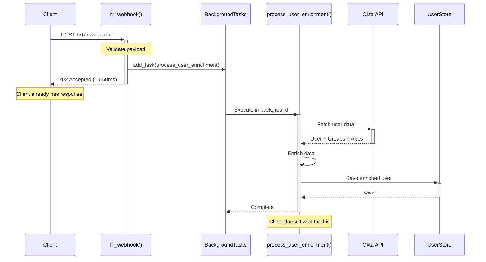

**Performance Comparison:**

| Approach | Response Time | Throughput | Client Experience |
|----------|--------------|------------|-------------------|
| **Background Tasks** ✅ | 10-50ms | High | Excellent |
| Async Immediate | 1-3s | Medium | Good |
| Synchronous ❌ | 1-3s sequential | Low | Poor |

**Implementation:**
```python
@router.post("/webhook", status_code=202)
async def hr_webhook(
    hr_user: HRUserIn,
    background_tasks: BackgroundTasks,
):
    # Queue the work
    background_tasks.add_task(process_user_enrichment, hr_user, store)
    
    # Return immediately (50-300x faster!)
    return {"status": "accepted"}
```

---

### 5. **Retry Pattern with Exponential Backoff** 🔄

Handles transient failures automatically:

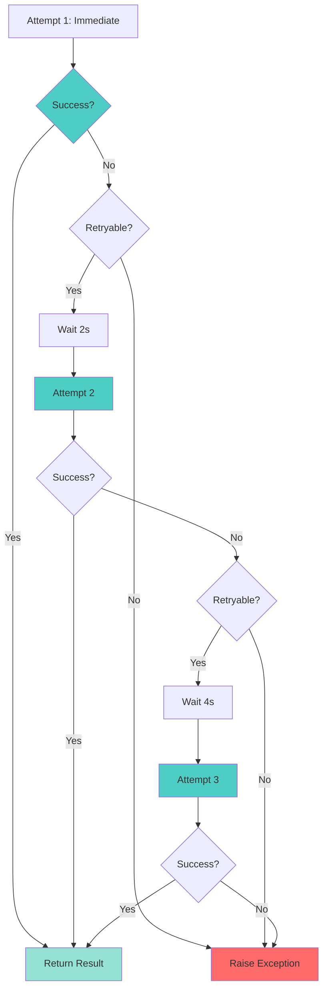

**Configuration:**
```python
@retry(
    stop=stop_after_attempt(3),
    wait=wait_exponential(multiplier=1, min=2, max=30),
    retry=should_retry_exception,
)
async def fetch_okta_data_with_retry(email: str):
    return await load_okta_user_by_email(email)

def should_retry_exception(exception):
    # Retry on transient errors
    if isinstance(exception, (OktaAPIError, ConnectionError, TimeoutError)):
        return True
    # Don't retry on permanent failures
    if isinstance(exception, OktaUserNotFoundError):
        return False
```

**Retry Timeline:**
- **Attempt 1:** Immediate (0s)
- **Attempt 2:** After 2s wait
- **Attempt 3:** After 4s wait (total: 6s)
- **Final:** After 8s wait (total: 14s) - then fail

---

### 6. **Singleton Pattern** 🔒

Single shared instance for configuration and storage:

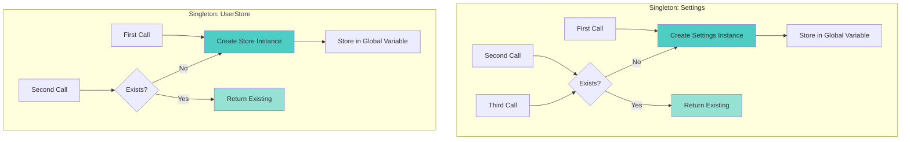

**Implementation:**
```python
# app/dependencies.py
_user_store: Optional[InMemoryUserStore] = None

def init_user_store() -> InMemoryUserStore:
    global _user_store
    if _user_store is None:
        _user_store = InMemoryUserStore()  # Created once
    return _user_store
```

---

### 7. **Middleware Pattern (Chain of Responsibility)** 🔗

Request processing pipeline:

```mermaid
graph LR
    Request[HTTP Request] --> M1[CORSMiddleware<br/>Allow Origins]
    M1 --> M2[APIKeyMiddleware<br/>Authentication]
    M2 --> Router[FastAPI Router<br/>Match Route]
    Router --> Validator[Pydantic Validator<br/>Validate Schema]
    Validator --> Handler[Endpoint Handler<br/>Business Logic]
    Handler --> ExHandler[Exception Handler<br/>Error Transform]
    ExHandler --> Response[HTTP Response]
    
    style Request fill:#ffe66d
    style M1 fill:#95e1d3
    style M2 fill:#ff6b6b
    style Router fill:#4ecdc4
    style Response fill:#ffe66d
```

**Configuration:**
```python
# app/main.py
app.add_middleware(CORSMiddleware, allow_origins=["*"])
app.add_middleware(APIKeyMiddleware)
```

**Request Flow:**
1. **CORS Middleware**: Check origin, add headers
2. **API Key Middleware**: Validate X-API-Key header
3. **Router**: Match URL to endpoint
4. **Validator**: Validate request body with Pydantic
5. **Handler**: Execute business logic
6. **Exception Handler**: Transform errors to HTTP responses

---

### 8. **Adapter Pattern** 🔌

Okta service adapts external API to internal models:

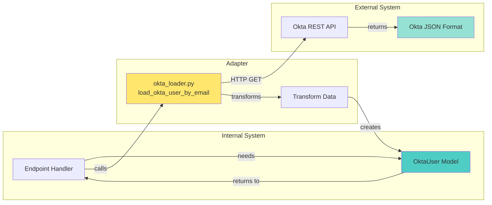

**Adaptation:**
```python
async def load_okta_user_by_email(email: str) -> OktaUser:
    # Call external API (Okta's format)
    raw_data = await _find_okta_user_by_email(...)
    # {
    #   "id": "00u...",
    #   "profile": {"login": "user@example.com", ...}
    # }
    
    # Adapt to internal model
    return OktaUser(
        okta_id=raw_data["id"],
        profile=OktaProfile(**raw_data["profile"]),
        groups=await _get_user_groups(...),
        applications=await _get_user_applications(...)
    )
```

---

### 9. **Factory Pattern** 🏭

Application factory creates configured FastAPI instance:

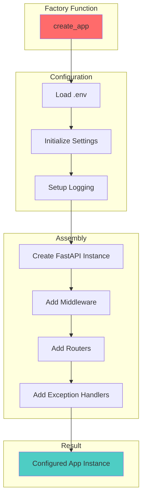

**Benefits:**
- ✅ Centralized configuration
- ✅ Easy to create test apps with different configs
- ✅ Flexible initialization order

---

### 10. **Custom Exception Hierarchy** ⚠️

Structured error handling:

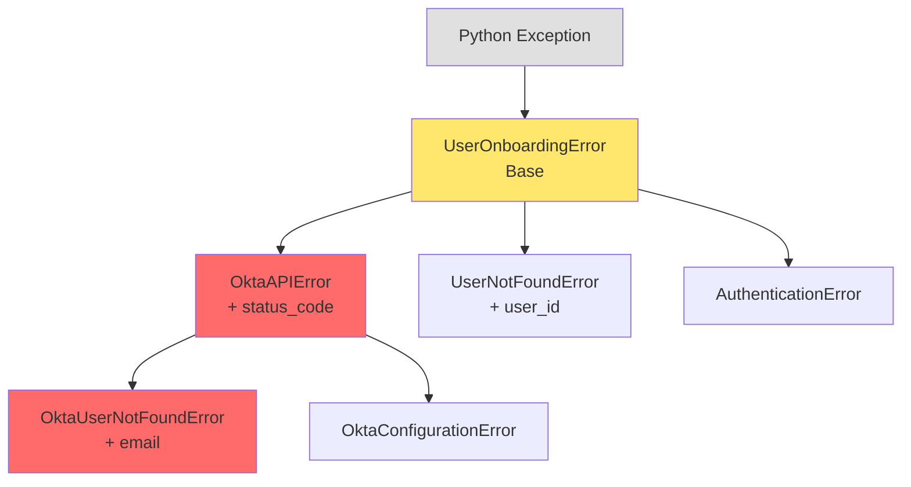

**Exception Handling Strategy:**
```python
try:
    okta_data = await load_okta_user_by_email(email)
except OktaUserNotFoundError:
    raise HTTPException(404, "User not found in Okta")
except OktaConfigurationError:
    raise HTTPException(500, "Configuration error")
except OktaAPIError:
    raise HTTPException(502, "Okta API error")
```

---

## Overall System Architecture

**Architecture Style:** Event-Driven Layered Microservice with Async Processing

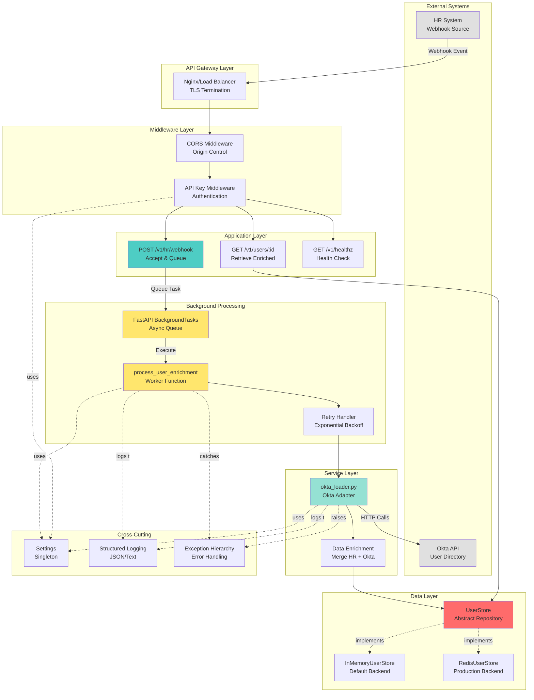

### Data Flow

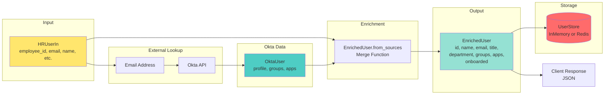

---

### Design Principles Applied

**SOLID Principles:**
- ✅ **S**ingle Responsibility: Each class/module has one job
- ✅ **O**pen/Closed: Can extend (add RedisStore) without modifying existing code
- ✅ **L**iskov Substitution: Can swap InMemoryStore ↔ RedisStore
- ✅ **I**nterface Segregation: Focused interfaces (put/get, not bloated)
- ✅ **D**ependency Inversion: Depend on abstractions (Depends pattern)

**Other Principles:**
- ✅ **Separation of Concerns**: Clear layer boundaries
- ✅ **DRY**: Centralized config, logging, exception handling
- ✅ **Fail Fast**: Configuration validated at startup
- ✅ **Loose Coupling**: Dependency injection enables swappable components
- ✅ **High Cohesion**: Related functionality grouped together

---

### Performance Characteristics

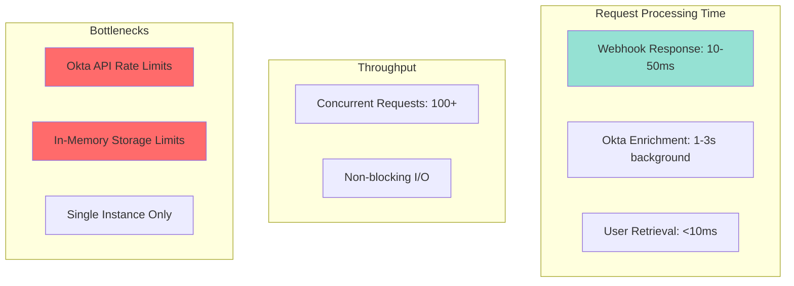

**Performance Summary:**
- **Webhook Response:** 10-50ms (202 Accepted)
- **Background Enrichment:** 1-3 seconds
- **User Retrieval:** <10ms (in-memory lookup)
- **Concurrent Webhooks:** 100+ (async/await)
- **Bottleneck:** Okta API rate limits, memory storage

---

## Module Dependency Graph

Shows how different modules import and depend on each other.

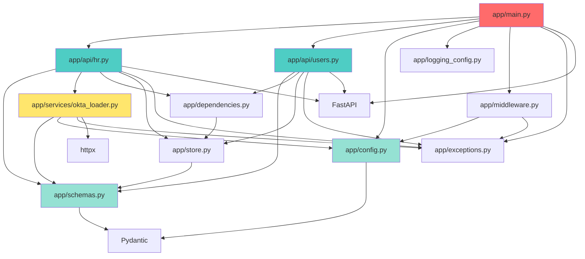

---

## Class Hierarchy

Shows all classes and their inheritance relationships.

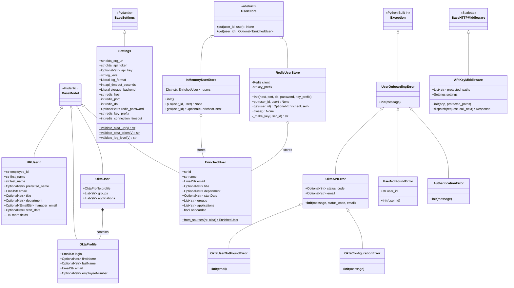

---

## Request Flow Diagram

Shows the complete flow of a webhook request through the system with **background processing**.

```mermaid
sequenceDiagram
    actor Client
    participant Middleware as APIKeyMiddleware
    participant Endpoint as hr_webhook()
    participant BgQueue as BackgroundTasks
    participant Worker as process_user_enrichment()
    participant Retry as fetch_okta_data_with_retry()
    participant Service as load_okta_user_by_email()
    participant Okta as Okta API
    participant Enricher as EnrichedUser.from_sources()
    participant Store as InMemoryUserStore
    
    Client->>+Middleware: POST /v1/hr/webhook<br/>{HR user data}
    
    alt API_KEY configured
        Middleware->>Middleware: Validate X-API-Key header
        alt Invalid or missing key
            Middleware-->>Client: 401/403 Unauthorized
        end
    end
    
    Middleware->>+Endpoint: Forward request
    
    Note over Endpoint: Validate HRUserIn schema<br/>(Pydantic)
    
    Endpoint->>BgQueue: add_task(process_user_enrichment, hr_user, store)
    Note over BgQueue: Task queued for<br/>background processing
    
    Endpoint-->>-Middleware: 202 Accepted<br/>{status: "accepted"}
    Middleware-->>-Client: 202 Accepted (10-50ms)
    
    Note over Client: Client already has response!
    
    Note over BgQueue,Store: Background processing starts AFTER response sent
    
    BgQueue->>+Worker: Execute task
    Worker->>+Retry: await fetch_okta_data_with_retry(email)
    
    Note over Retry: Retry with exponential backoff<br/>Max 3 attempts: 0s, 2s, 4s
    
    Retry->>+Service: Attempt 1
    Service->>Service: get_settings()<br/>Validate configuration
    Service->>+Okta: GET /api/v1/users?search=email
    Okta-->>-Service: User data
    
    alt User not found
        Service-->>Retry: raise OktaUserNotFoundError
        Retry-->>Worker: Exception (no retry)
        Worker->>Worker: Log error
        Worker-->>-BgQueue: Complete (failed)
    else Success
        Service->>+Okta: GET /api/v1/users/{id}/groups
        Okta-->>-Service: Groups list
        
        Service->>+Okta: GET /api/v1/users/{id}/appLinks
        Okta-->>-Service: Applications list
        
        Service->>Service: Build OktaUser model
        Service-->>-Retry: Return OktaUser
        Retry-->>-Worker: Return OktaUser
        
        Worker->>+Enricher: from_sources(hr_user, okta_user)
        Enricher->>Enricher: Merge HR + Okta data
        Enricher-->>-Worker: EnrichedUser
        
        Worker->>+Store: put(user_id, enriched_user)
        Store->>Store: Store in _users dict
        Store-->>-Worker: None
        
        Worker->>Worker: Log success
        Worker-->>-BgQueue: Complete (success)
    end
```

---

## Data Model Relationships

Shows how data flows and transforms through the system.

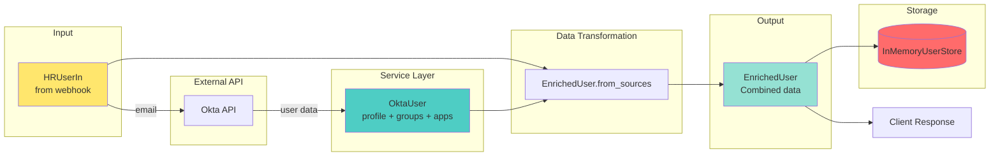

---

## Service Layer Architecture

Shows the async service functions and their dependencies.

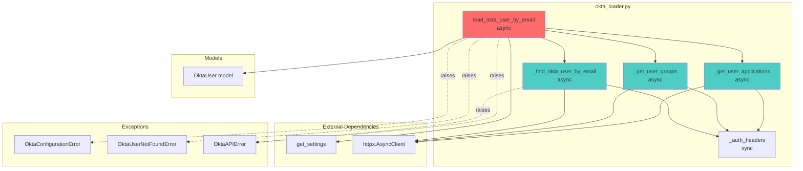

---

## Function Call Graph

Complete function dependency tree.

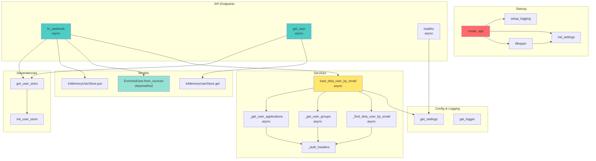

---

## Middleware Pipeline

Shows the request processing pipeline.

```mermaid
graph LR
    Request[HTTP Request] --> CORS[CORSMiddleware]
    CORS --> APIKey[APIKeyMiddleware]
    APIKey --> Router[FastAPI Router]
    Router --> Endpoint[Endpoint Handler]
    Endpoint --> ExceptionHandler[Exception Handlers]
    ExceptionHandler --> Response[HTTP Response]
    
    style Request fill:#ffe66d
    style CORS fill:#95e1d3
    style APIKey fill:#ff6b6b
    style Router fill:#4ecdc4
    style Response fill:#ffe66d
```

---

## Configuration Dependency Tree

Shows how configuration flows through the application.

```mermaid
graph TD
    env[.env file]
    env_example[env.example<br/>template]
    
    env --> Settings
    
    subgraph "config.py"
        Settings[Settings class<br/>Pydantic BaseSettings]
        get_settings[get_settings]
        init_settings[init_settings]
    end
    
    Settings --> get_settings
    get_settings --> init_settings
    
    init_settings --> main[app/main.py<br/>create_app]
    get_settings --> okta[okta_loader.py<br/>load_okta_user_by_email]
    get_settings --> middleware[middleware.py<br/>APIKeyMiddleware]
    get_settings --> healthz[healthz endpoint]
    
    Settings -.validates.-> okta_url[OKTA_ORG_URL]
    Settings -.validates.-> okta_token[OKTA_API_TOKEN]
    Settings -.validates.-> api_key[API_KEY]
    Settings -.validates.-> log_level[LOG_LEVEL]
    Settings -.validates.-> log_format[LOG_FORMAT]
    
    style env fill:#ff6b6b
    style Settings fill:#4ecdc4
```

---

## Exception Handling Flow

Shows how exceptions propagate through the system.

```mermaid
graph TD
    subgraph "Okta Service"
        okta_service[load_okta_user_by_email]
    end
    
    subgraph "Raised Exceptions"
        config_err[OktaConfigurationError]
        not_found[OktaUserNotFoundError]
        api_err[OktaAPIError]
    end
    
    subgraph "API Endpoint"
        hr_endpoint[hr_webhook]
    end
    
    subgraph "Exception Handlers"
        try_catch[try/except blocks]
    end
    
    subgraph "HTTP Responses"
        resp_500[500 Internal Server Error]
        resp_404[404 Not Found]
        resp_502[502 Bad Gateway]
    end
    
    okta_service -.raises.-> config_err
    okta_service -.raises.-> not_found
    okta_service -.raises.-> api_err
    
    config_err --> try_catch
    not_found --> try_catch
    api_err --> try_catch
    
    try_catch -- OktaConfigurationError --> resp_500
    try_catch -- OktaUserNotFoundError --> resp_404
    try_catch -- OktaAPIError --> resp_502
    
    style config_err fill:#ff6b6b
    style not_found fill:#ffe66d
    style api_err fill:#ff6b6b
```

---

## Testing Structure

Shows test organization and what they test.

```mermaid
graph TD
    subgraph "Test Files"
        conftest[conftest.py<br/>Fixtures]
        test_api[test_api.py]
        test_schemas[test_schemas.py]
        test_store[test_store.py]
        test_okta[test_okta_loader.py]
    end
    
    subgraph "Fixtures"
        app_fixture[app fixture]
        client_fixture[client fixture]
        settings_fixture[test_settings fixture]
        store_fixture[user_store fixture]
        hr_fixture[sample_hr_user fixture]
        okta_fixture[sample_okta_user fixture]
    end
    
    subgraph "Tested Components"
        api[API Endpoints]
        schemas[Pydantic Models]
        store[InMemoryUserStore]
        okta_loader[Okta Service]
    end
    
    conftest --> app_fixture
    conftest --> client_fixture
    conftest --> settings_fixture
    conftest --> store_fixture
    conftest --> hr_fixture
    conftest --> okta_fixture
    
    test_api --> client_fixture
    test_api --> hr_fixture
    test_api --> okta_fixture
    test_api --> api
    
    test_schemas --> hr_fixture
    test_schemas --> okta_fixture
    test_schemas --> schemas
    
    test_store --> store_fixture
    test_store --> store
    
    test_okta --> okta_loader
    
    style conftest fill:#95e1d3
    style test_api fill:#4ecdc4
    style test_schemas fill:#4ecdc4
    style test_store fill:#4ecdc4
    style test_okta fill:#4ecdc4
```

---

## Key Observations

### 1. **Architecture Patterns Used** 🏗️

This project implements **10+ software architecture patterns**:

| Pattern | Purpose | Location |
|---------|---------|----------|
| **Layered Architecture** | Separation of concerns | API → Service → Data → Model layers |
| **Dependency Injection** | Loose coupling | FastAPI `Depends()` throughout |
| **Repository Pattern** | Abstract storage | `UserStore` with InMemory & Redis backends |
| **Singleton Pattern** | Shared instances | Settings, UserStore |
| **Factory Pattern** | App configuration | `create_app()` |
| **Background Processing** | Async execution | FastAPI BackgroundTasks |
| **Retry Pattern** | Resilience | Exponential backoff for Okta calls |
| **Middleware Pattern** | Request pipeline | CORS, Auth chain |
| **Adapter Pattern** | External integration | Okta API adapter |
| **Strategy Pattern** | Configurable behavior | Logging formats, storage backends |

### 2. **Layered Architecture**
- **API Layer** (`app/api/`): HTTP request/response handling
- **Service Layer** (`app/services/`): Business logic and external integrations
- **Data Layer** (`app/store.py`): Persistence abstraction with `UserStore`, `InMemoryUserStore`, `RedisUserStore`
- **Model Layer** (`app/schemas.py`): Data validation and transfer objects
- **Cross-Cutting** (`app/config.py`, `app/exceptions.py`, `app/logging_config.py`): Shared concerns

**Benefits:**
- ✅ Easy to test each layer independently
- ✅ Swap storage backends via configuration (InMemory ↔ Redis)
- ✅ Clear responsibilities and boundaries
- ✅ Production-ready with Redis backend

### 3. **Dependency Direction**
- Dependencies flow **downward only** (API → Service → Data)
- Core modules (config, exceptions, logging) are imported by many
- **No circular dependencies**
- Dependency Injection via FastAPI's `Depends()`

```
┌─────────────┐
│  API Layer  │ ← External requests
└──────┬──────┘
       ↓
┌─────────────┐
│   Service   │ ← Business logic
└──────┬──────┘
       ↓
┌─────────────┐
│    Data     │ ← Storage
└─────────────┘
```

### 4. **Async + Background Processing Pattern**
- All API endpoints are `async def`
- Okta service functions are `async`
- Uses `httpx.AsyncClient` for non-blocking I/O
- **Background tasks** for webhook processing (202 Accepted pattern)
- Retry mechanism with exponential backoff

**Performance Impact:**
- Webhook response: **10-50ms** (vs. 1-3s if synchronous)
- Concurrent webhooks: **100+** (async/await)
- Background enrichment: **1-3s** (doesn't block client)

### 5. **Error Handling Architecture**
- **Custom exception hierarchy** rooted in `UserOnboardingError`
- Exceptions raised in **service layer**
- Caught and transformed to HTTP responses in **API layer**
- Global exception handlers in `app/main.py`

**Exception Flow:**
```
Service → raise OktaUserNotFoundError
    ↓
Endpoint → catch → HTTPException(404)
    ↓
Client ← 404 Not Found
```

### 6. **Configuration Management**
- **Centralized** in `Settings` class (Pydantic BaseSettings)
- **Validated at startup** (fail-fast pattern)
- **Injected** via dependency injection
- Supports `.env` files and environment variables

**Validation Examples:**
- URL normalization (removes trailing slash)
- Token format validation (must start with specific prefix)
- Log level validation (must be valid Python logging level)

### 7. **Resilience Patterns**
- **Retry Pattern**: Automatic retry with exponential backoff (3 attempts)
- **Selective Retry**: Only retries transient errors (not 404s)
- **PII Scrubbing**: Privacy protection in all logs
- **Structured Logging**: Machine-readable JSON format

**Retry Timeline:**
- Attempt 1: Immediate
- Attempt 2: Wait 2s
- Attempt 3: Wait 4s
- Total max: ~6-8s before final failure

### 8. **Testing Architecture**
- **Shared fixtures** in `conftest.py`
- **Mocks** for external dependencies (Okta API)
- **Test organization** by component:
  - `test_api.py` → API endpoints
  - `test_schemas.py` → Pydantic models
  - `test_store.py` → Storage layer
  - `test_okta_loader.py` → Okta service
- **Dependency injection** makes testing easy (swap real store with mock)

### 9. **SOLID Principles Applied**
- ✅ **Single Responsibility**: Each class has one job
- ✅ **Open/Closed**: Extensible without modification (add RedisStore)
- ✅ **Liskov Substitution**: Can swap InMemoryStore ↔ RedisStore
- ✅ **Interface Segregation**: Focused interfaces (put/get)
- ✅ **Dependency Inversion**: Depends on abstractions, not implementations

### 10. **Scalability Considerations**

**Current Options:**

**In-Memory Storage** (Default):
- ❌ Single instance only
- ❌ No persistence
- ✅ Fastest performance
- ✅ Zero infrastructure

**Redis Storage** (Available ✅):
- ✅ Persistence across restarts
- ✅ Horizontal scaling support
- ✅ Multiple instances can share data
- ⚠️ Requires Redis infrastructure

**Future Enhancements:**
- Replace `BackgroundTasks` with Celery/RQ (distributed queue)
- Add load balancer (horizontal scaling with Redis backend)
- Add PostgreSQL backend (complex queries, audit trails)
- All achievable thanks to Repository and DI patterns!

---

## How to Read These Diagrams

- **Boxes/Nodes**: Classes, functions, or modules
- **Arrows**: Dependencies or calls
- **Dotted arrows**: Raises exceptions or optional relationships
- **Subgraphs**: Logical grouping of related components
- **Colors**: Different component types (API, Service, Data, etc.)

---

## Viewing These Diagrams

These Mermaid diagrams can be viewed in:
- GitHub (renders automatically)
- VS Code (with Mermaid extension)
- JetBrains IDEs (with Mermaid plugin)
- Online: https://mermaid.live/

Or use any Markdown viewer that supports Mermaid syntax.

