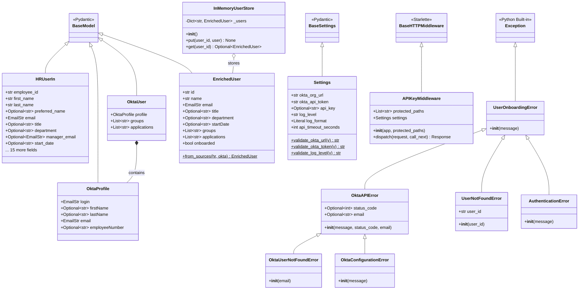

# Architecture & Dependency Diagrams

## Table of Contents
1. [Module Dependency Graph](#module-dependency-graph)
2. [Class Hierarchy](#class-hierarchy)
3. [Request Flow Diagram](#request-flow-diagram)
4. [Data Model Relationships](#data-model-relationships)
5. [Service Layer Architecture](#service-layer-architecture)

---

## Module Dependency Graph

Shows how different modules import and depend on each other.

---

## Class Hierarchy

Shows all classes and their inheritance relationships.

---

## Request Flow Diagram

Shows the complete flow of a webhook request through the system.

---

## Data Model Relationships

Shows how data flows and transforms through the system.

---

## Service Layer Architecture

Shows the async service functions and their dependencies.

---

## Function Call Graph

Complete function dependency tree.

---

## Middleware Pipeline

Shows the request processing pipeline.

---

## Configuration Dependency Tree

Shows how configuration flows through the application.

---

## Exception Handling Flow

Shows how exceptions propagate through the system.

---

## Testing Structure

Shows test organization and what they test.

---

## Key Observations

### 1. **Layered Architecture**
- **API Layer**: Handles HTTP requests/responses
- **Service Layer**: Business logic and external integrations
- **Data Layer**: In-memory storage
- **Clean separation** enables easy testing and maintenance

### 2. **Dependency Direction**
- Dependencies flow **downward** (API → Service → Data)
- Core modules (config, exceptions) are imported by many
- No circular dependencies

### 3. **Async Pattern**
- All API endpoints are `async`
- Okta service functions are `async`
- Uses `httpx.AsyncClient` for non-blocking I/O

### 4. **Error Handling**
- Custom exception hierarchy
- Exceptions raised in services
- Caught and transformed to HTTP responses in endpoints

### 5. **Configuration**
- Centralized in `Settings` class
- Validated at startup
- Injected via dependency injection

### 6. **Testing**
- Shared fixtures in `conftest.py`
- Mocks for external dependencies
- Tests organized by component

---

## How to Read These Diagrams

- **Boxes/Nodes**: Classes, functions, or modules
- **Arrows**: Dependencies or calls
- **Dotted arrows**: Raises exceptions or optional relationships
- **Subgraphs**: Logical grouping of related components
- **Colors**: Different component types (API, Service, Data, etc.)

---

## Viewing These Diagrams

These Mermaid diagrams can be viewed in:
- GitHub (renders automatically)
- VS Code (with Mermaid extension)
- JetBrains IDEs (with Mermaid plugin)
- Online: https://mermaid.live/

Or use any Markdown viewer that supports Mermaid syntax.

